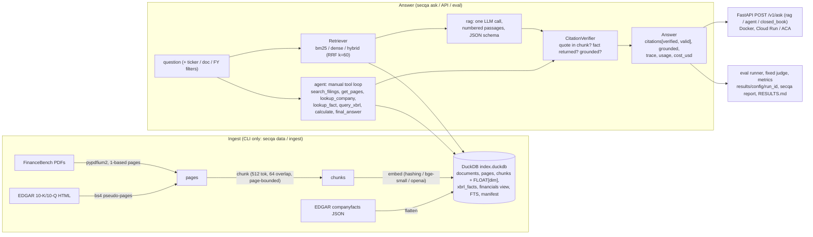

# sec-filing-qa

Grounded question answering over SEC 10-K/10-Q filings: hybrid retrieval with page-level,
**verified** citations, a tool-using agent over local XBRL facts (search, read-only SQL, curated
fact lookup, calculator), a FastAPI service packaged as one container for GCP Cloud Run and Azure
Container Apps, and a reproducible, per-question-logged, offline-rescorable FinanceBench harness
that compares OpenAI and Anthropic models under one fixed judge.

The one-line pitch: **every number in an answer is traceable to a filing page or an XBRL fact,
abstention is scored, and a citation the system cannot verify is flagged, never hidden.**

## Why this exists

Finance QA demos are easy to make look good and hard to trust. This repository is built around
three refusals:

1. **No unverifiable citation.** A model-supplied quote must be a normalised substring (>= 20
   characters) of the retrieved chunk, or the citation is kept with `verified=false`. The snippet
   shown to a user always comes from the store, never from the model.
2. **No unpublished provenance.** Every number in [`RESULTS.md`](RESULTS.md) comes from a committed
   `summary.json` carrying the git SHA, index hash, prompt hashes, judge version and price-list
   date. Rows that have not been run say `pending (not run)` with the reason. Mock/CI numbers
   never appear in the tables.
3. **No framework magic.** The agent loop, retrieval fusion, SQL guard and judge are a few hundred
   lines of explicit Python each, with the design choices written up as ADRs in
   [`docs/decisions.md`](docs/decisions.md). Boring components only: DuckDB, pypdfium2, FastAPI.

## Live demo and status

| Target | Status as of 2026-09-17 | Where |
| --- | --- | --- |
| GCP Cloud Run | workflow written (`.github/workflows/deploy-cloudrun.yml`), deployment not yet verified | — |
| Azure Container Apps | workflow written (`.github/workflows/deploy-azure.yml` + `infra/azure/main.bicep`), deployment not yet verified | — |
| Container image (GHCR) | built and published by the build workflow on 2026-09-17 (commit `77d1a02`, targets `full` and `slim`); the package is private until the owner makes it public | [`.github/workflows/build.yml`](.github/workflows/build.yml) |
| FinanceBench numbers | 16 of 16 configured rows run (10 answering rows + 6 retrieval rows, 150 questions each; see [Results](#results)) | [`RESULTS.md`](RESULTS.md) |

The wording above follows the rule in `SPEC.md` section 9: a target reads "deployed and
smoke-tested on `<date>`" only after its CI job has one green run whose smoke output (`/readyz` and
one `POST /v1/ask`) is in the job summary. Until then it says exactly what it says here.

## Quickstart

Three commands, no API keys, no network beyond package downloads (Python 3.11, [uv](https://docs.astral.sh/uv/)):

```bash
uv sync --extra dev --extra openai --extra anthropic                    # 1. venv with the dev tools and vendor SDKs
uv run --no-sync secqa eval --config configs/rag_mock.yaml --limit 6    # 2. build the fixture index, run the harness end to end
uv run --no-sync secqa serve --db data/fixture_index.duckdb             # 3. serve the API; open http://localhost:8080/docs
```

Step 2 renders the synthetic two-document fixture corpus to PDF, ingests it through the real
pipeline (pypdfium2 -> page-bounded chunks -> hashing embedder -> DuckDB), answers six fixture
questions with the deterministic `mock` provider, verifies the citations, scores them with the
rule judge, and writes `results/rag_mock/<run_id>/{config.json,predictions.jsonl,summary.json}`.
It is the same command CI runs.

Then ask something:

```bash
curl -s -X POST http://localhost:8080/v1/ask -H 'Content-Type: application/json' \
  -d '{"question": "What were total net sales in fiscal 2023?", "provider": "mock", "k": 4}' | python -m json.tool
```

or from the command line, with the trace of every retrieval / LLM / verification step:

```bash
uv run --no-sync secqa ask --db data/fixture_index.duckdb --trace "What were total net sales in fiscal 2023?"
```

`uv run --no-sync secqa doctor --offline` reports what the current environment can do (keys,
model ids, `SEC_USER_AGENT`, DuckDB FTS, index), so a pending cell in the results table is
explained rather than guessed.

### Offline mode

The default test suite and the smoke evaluation need **no network and no API keys**:

- `uv run --no-sync pytest -q` runs every offline test. Tests that hit a vendor API are marked
  `@pytest.mark.live`, tests that download model weights `@pytest.mark.slow`; both are skipped by
  default (`pyproject.toml` `addopts`).
- Providers `mock` (extractive: quotes the first >= 20-character sentence of the top passage with
  its `chunk:<id>` ref, so the verifier marks it verified), `mock:abstain` (retrieval-only rows)
  and `scripted:<yaml>` (turn-indexed scenarios for agent, judge and prompt-injection tests) are
  fully deterministic.
- The `hashing` embedder (scikit-learn `HashingVectorizer`, 384-d) needs no downloads. It is not
  semantic and is never used for published numbers; those use `local` = `BAAI/bge-small-en-v1.5`
  (`uv sync --extra local`).
- EDGAR and OpenAI-embedding HTTP calls are `respx`-mocked from fixtures; test PDFs are generated
  in-test with reportlab. No dataset rows or third-party PDFs are committed.
- Published runs can be **re-scored without keys**: `secqa rescore --run results/<config>/<run_id>`
  replays every LLM and judge call from the run's cassette (`ReplayCacheProvider`, mode `replay`;
  a miss raises `CassetteMiss` instead of paying).

### Real corpus without keys (network only)

```bash
export SEC_USER_AGENT="Your Name you@example.com"      # SEC fair-access policy
uv sync --extra dev --extra local                       # bge-small-en-v1.5 via sentence-transformers
uv run --no-sync secqa data financebench --pdfs         # 150 questions (HF, CC-BY-NC-4.0) + ~80 PDFs, cached under data/raw/
uv run --no-sync secqa ingest financebench --embedder local
uv run --no-sync python scripts/check_page_indexing.py  # gate: evidence found on the 1-based page for >= 90% of a 25-question sample
uv run --no-sync secqa eval --config configs/retrieval_hybrid.yaml   # page_recall@k, overlap recall, MRR; no answering model
uv run --no-sync secqa report results/ --out RESULTS.md
```

Real LLM rows additionally need `OPENAI_API_KEY` / `ANTHROPIC_API_KEY` exported; each config
carries a per-question and a per-run cost cap, runs resume, and every paid call is recorded to a
cassette so nothing is paid twice.

## Architecture

One process, one DuckDB file, Python 3.11. Ingest is CLI-only (ADR-07); the API never writes to
the index and never touches EDGAR.



The same picture as text:

```
 FinanceBench PDFs ──pypdfium2──┐                       ┌── /v1/ask (rag | agent | closed_book)
 EDGAR 10-K/10-Q HTML ─bs4──────┼─ pages ─ chunk ─ embed ─► DuckDB index.duckdb ◄──┤   FastAPI ── Docker ── Cloud Run / ACA
 EDGAR companyfacts JSON ───────┘  (documents, pages, chunks[+FLOAT[dim]], xbrl_facts, financials, FTS)
                                                         ▲
   Retriever(bm25 | dense | hybrid=RRF) ── rag.answer ───┤── CitationVerifier ── Answer{citations[verified], grounded, trace, usage, cost}
   agent.AgentLoop (manual loop, 6 tools + final_answer) ┘
   eval.runner ── judge (fixed claude-sonnet-5) ── metrics ── results/<run>/predictions.jsonl ── secqa report ── RESULTS.md
```

### Layers

| Layer | Package | What it owns |
| --- | --- | --- |
| core | `secqa.core` | the shared pydantic contracts (`CONTRACTS.md`), settings, errors, ids, number normalisation, structlog |
| providers | `secqa.providers` | `mock`, `scripted`, `openai:<model>`, `anthropic:<model>`, `ReplayCacheProvider` cassettes, price table (`eval/models.yaml`) |
| embeddings | `secqa.embeddings` | `hashing` (offline), `local` (bge-small-en-v1.5), `openai` (text-embedding-3-small) |
| edgar | `secqa.edgar` | the only module that talks to sec.gov: declared User-Agent, 8 req/s token bucket, tenacity retries on 429/503, sha256 disk cache |
| ingest | `secqa.ingest` | pypdfium2 page text (page numbers preserved), EDGAR HTML to pseudo-pages, page-bounded overlapping chunks with `Item N.` section hints |
| store | `secqa.store` | DuckDB schema (`schema.sql`, `FLOAT[{dim}]` from the embedder), FTS BM25, brute-force cosine, reciprocal-rank fusion, manifest, read-only connections |
| grounding | `secqa.grounding` | `CitationVerifier`: valid / verified citations, store-sourced snippets, the `grounded` flag |
| xbrl | `secqa.xbrl` | companyfacts loader, curated `financials` view (`tags.yaml` alias chains), sqlglot read-only SQL guard, `lookup_fact` |
| retrieval | `secqa.retrieval` | one `Retriever` with strategy switch and ticker / doc / fiscal-year / form filters |
| indexing | `secqa.indexing` | FinanceBench corpus builder, EDGAR ticker pipeline, index tarball pack / fetch, manifest |
| rag | `secqa.rag` | prompts (hashed), `ANSWER_SCHEMA`, single-shot `rag` / `closed_book` / `oracle` answering |
| agent | `secqa.agent` | tool schemas, `ToolRuntime`, the manual `AgentLoop` with stopping rules, the AST-whitelisted calculator |
| eval | `secqa.eval` | FinanceBench loader (0-indexed page fix in one place), runner, metrics, judges, rescore, report |
| api | `secqa.api` | `create_app`: endpoints, problem+json errors, request ids, `Server-Timing`, slowapi rate limit, budgets |
| cli | `secqa.cli` | `secqa doctor / data / ingest / index / ask / eval / rescore / report / serve / export` |

### How one question is answered

1. `Retriever.retrieve(question, k, filters)` embeds the query once (only if the strategy needs a
   vector), runs BM25 (`fts_main_chunks.match_bm25`) and/or cosine over `chunks.embedding`, and
   fuses with RRF. Filters resolve to a concrete `doc_names` list through `documents`.
2. **rag**: one `provider.complete()` call with numbered passages (`[n] (ref: chunk:<id>)`) and a
   JSON schema `{answer, value, unit, citations[{ref, quote}], abstain}`. An empty retrieval
   abstains without an LLM call. **agent**: `AgentLoop` calls the provider with the six tool
   schemas; all tool calls of a step are executed and returned in one tool message; tools never
   raise (they return `{"error": ...}`); the loop stops on `final_answer` or on a stopping rule
   (max 8 steps, 12 tool calls, 200k input tokens, projected cost cap, 90 s wall clock, three
   identical calls, two consecutive failures of one tool), after which one tools-off call asks
   for an answer from the evidence gathered or `INSUFFICIENT EVIDENCE`.
3. `CitationVerifier.verify()` resolves each ref against what *this request* retrieved
   (`valid`), checks the quote is a normalised substring of the chunk (`verified`), takes the
   snippet from the store, and sets `grounded` when every numeric token in the answer text appears
   in a verified quote, a verified XBRL fact or a `calculate()` result of this request.
4. The `Answer` carries citations, retrieved hits, the full trace with per-step usage, cost from
   `models.yaml`, retrieval vs LLM latency, `terminated_by` and the prompt hashes it used.

### Guardrails

- Retrieved text and SQL rows are data, not instructions: every answering prompt says so, and a
  test injects "ignore previous instructions" into a fixture chunk.
- `query_xbrl` / `POST /v1/xbrl/query`: sqlglot allowlist (single `SELECT`/`WITH`, tables
  `xbrl_facts` / `financials` / `documents` only, no table, file or size-from-argument generator
  functions, `LIMIT 200` forced, 512 MB DuckDB `memory_limit`, 4 KB cells)
  *and* a DuckDB `BEGIN TRANSACTION READ ONLY` per statement, in a worker thread with a 5 s
  interrupt.
- `calculate`: Python `ast` whitelist (numbers, `+ - * / ** %`, unary minus, parentheses,
  `abs/round/min/max`), bounded exponents.
- No tool has network access; EDGAR is reached only by `secqa data` / `secqa ingest`.
- Secrets only via environment (`OPENAI_API_KEY`, `ANTHROPIC_API_KEY`, `SEC_USER_AGENT`,
  `SECQA_API_KEY`); gitleaks runs in CI and pre-commit; a local hook refuses PDFs, DuckDB files,
  cassettes and `.env`.

**Headline (150 FinanceBench questions each, one fixed judge; details in [`docs/EVAL.md`](docs/EVAL.md)):**

- Closed-book Claude Opus 5 already scores **66%** with no document in context, so accuracy alone
  cannot show grounding here; what the grounded modes add is that **97–100% of their citations are
  verbatim quotes from a filing page**.
- Text-only RAG restricted to the question's filing: **58%** (Claude) / **46%** (GPT-5.5); corpus-wide
  over all 84 filings: 42.7% / 27.3%, below closed-book, because the models abstain when the
  retrieved chunks lack the figure.
- The tool-using agent (XBRL fact lookup, read-only SQL, calculator): **78.7%** / **78.0%** with
  100% of citations verified, at 3x the cost and latency of RAG for Claude.
- Oracle (gold pages given): 84.0% / 77.3%, the ceiling better retrieval could reach.

<!-- results:start -->
## Results

Generated by `secqa report` on 2026-09-18 03:41 UTC from `results/` (16 complete, 0 pending of 16 rows).

Every number below comes from a committed `summary.json`; pending rows have not been run, partial rows stopped early and subset rows were run with `--limit`. FinanceBench open set, 150 questions, one fixed judge per row. 95% intervals are percentile bootstraps (2000 resamples, seed 0): at n = 150 they span roughly ±7–8 pp, and overlapping intervals are not evidence of a difference.

### Retrieval (no answering model)

| Config | Strategy | k | n | Page recall@5 | Page recall@10 | Page recall@20 | Overlap recall@10 | Gold page MRR | Retrieval p50 ms | Status |
| --- | --- | --- | --- | --- | --- | --- | --- | --- | --- | --- |
| `retrieval_bm25` | bm25 | 20 | 150 | 14.0% | 20.7% | 24.7% | 17.3% | 0.088 | 34 | complete |
| `retrieval_bm25_docfilter` | bm25 | 20 | 150 | 44.0% | 57.3% | 65.3% | 46.0% | 0.294 | 30 | complete |
| `retrieval_dense` | dense | 20 | 150 | 37.3% | 46.7% | 54.0% | 38.0% | 0.260 | 52 | complete |
| `retrieval_dense_docfilter` | dense | 20 | 150 | 56.7% | 70.0% | 79.3% | 54.7% | 0.421 | 20 | complete |
| `retrieval_hybrid` | hybrid | 20 | 150 | 33.3% | 42.7% | 50.0% | 34.7% | 0.215 | 88 | complete |
| `retrieval_hybrid_docfilter` | hybrid | 20 | 150 | 54.0% | 67.3% | 74.7% | 50.7% | 0.425 | 51 | complete |

### Question answering

| Config | Mode | Provider:model | n | Accuracy (95% CI) | Abstain | Hallucination | Faithfulness | Citations verified | Grounded | Page recall@10 | p50 ms | $/question | Status |
| --- | --- | --- | --- | --- | --- | --- | --- | --- | --- | --- | --- | --- | --- |
| `closed_book_claude` | closed_book | `anthropic:claude-opus-5` | 150 | 66.0% [58.7%, 74.0%]† | 18.0% | 19.5% | — | n/a | 10.6% | n/a | 4,844 | $0.0133 | complete |
| `closed_book_gpt` | closed_book | `openai:gpt-5.5` | 150 | 46.0% [38.0%, 54.7%]† | 39.3% | 24.2% | — | n/a | 41.8% | n/a | 8,672 | $0.0235 | complete |
| `oracle_claude` | oracle | `anthropic:claude-opus-5` | 150 | 84.0% [78.0%, 90.0%]† | 0.0% | 16.0% | 94.1% | 99.2% | 21.3% | 100.0% | 4,794 | $0.0221 | complete |
| `oracle_gpt` | oracle | `openai:gpt-5.5` | 150 | 77.3% [70.7%, 84.0%]† | 15.3% | 8.7% | 96.8% | 97.6% | 43.3% | 100.0% | 7,446 | $0.0276 | complete |
| `rag_hybrid_claude` | rag | `anthropic:claude-opus-5` | 150 | 42.7% [34.7%, 50.0%]† | 44.7% | 22.0% | 97.8% | 97.9% | 28.9% | 38.0% | 4,781 | $0.0444 | complete |
| `rag_hybrid_docfilter_claude` | rag | `anthropic:claude-opus-5` | 150 | 58.0% [50.0%, 65.3%]† | 28.0% | 19.4% | 96.8% | 97.3% | 24.1% | 62.0% | 5,722 | $0.0461 | complete |
| `rag_hybrid_docfilter_gpt` | rag | `openai:gpt-5.5` | 150 | 46.0% [38.0%, 54.0%]† | 47.3% | 12.7% | 99.6% | 100.0% | 55.7% | 62.0% | 7,359 | $0.0409 | complete |
| `rag_hybrid_gpt` | rag | `openai:gpt-5.5` | 150 | 27.3% [20.0%, 34.7%]† | 62.0% | 26.8% | 94.2% | 97.1% | 54.4% | 38.0% | 6,634 | $0.0376 | complete |
| `agent_hybrid_claude` | agent | `anthropic:claude-opus-5` | 150 | 78.7% [72.0%, 85.3%]† | 0.7% | 20.8% | 94.9% | 100.0% | 19.5% | 47.3% | 14,959 | $0.1334 | complete |
| `agent_hybrid_gpt` | agent | `openai:gpt-5.5` | 150 | 78.0% [71.3%, 84.0%]† | 2.0% | 20.4% | 94.1% | 100.0% | 52.4% | 48.7% | 9,311 | $0.0638 | complete |

† provisional: judge-vs-human agreement (Cohen's kappa) is missing or below 0.6 for this run; see `human_agreement.json`.
Hallucination = incorrect / (correct + incorrect). Faithfulness = supported claims / claims, judged against cited passages only. `n/a` = not defined for the mode.

### Judge agreement

| Config | Judge | Swap judge | Swap n | Swap kappa | Swap agreement | Human n | Human kappa | Human agreement |
| --- | --- | --- | --- | --- | --- | --- | --- | --- |
| `closed_book_claude` | `anthropic:claude-sonnet-5` | pending | pending | pending | pending | pending | pending | pending |
| `closed_book_gpt` | `anthropic:claude-sonnet-5` | pending | pending | pending | pending | pending | pending | pending |
| `oracle_claude` | `anthropic:claude-sonnet-5` | pending | pending | pending | pending | pending | pending | pending |
| `oracle_gpt` | `anthropic:claude-sonnet-5` | pending | pending | pending | pending | pending | pending | pending |
| `rag_hybrid_claude` | `anthropic:claude-sonnet-5` | pending | pending | pending | pending | pending | pending | pending |
| `rag_hybrid_docfilter_claude` | `anthropic:claude-sonnet-5` | pending | pending | pending | pending | pending | pending | pending |
| `rag_hybrid_docfilter_gpt` | `anthropic:claude-sonnet-5` | pending | pending | pending | pending | pending | pending | pending |
| `rag_hybrid_gpt` | `anthropic:claude-sonnet-5` | pending | pending | pending | pending | pending | pending | pending |
| `agent_hybrid_claude` | `anthropic:claude-sonnet-5` | pending | pending | pending | pending | pending | pending | pending |
| `agent_hybrid_gpt` | `anthropic:claude-sonnet-5` | pending | pending | pending | pending | pending | pending | pending |

Cohen's kappa between the row's effective labels (judge, numeric override included) and a second judge (`judge_swap_<provider>_<model>.json`, written by `secqa.eval.judge.judge_swap`) or the human-labelled subset (`human_agreement.json`, written by `secqa.eval.judge.human_agreement`); agreement = raw label agreement. `pending` = not yet computed for this row.

### Breakdown by question type

| Config | Question type | n | Accuracy | Abstain | Hallucination | Numeric match | Page recall@10 | Faithfulness |
| --- | --- | --- | --- | --- | --- | --- | --- | --- |
| `retrieval_bm25` | domain-relevant | 50 | 0.0% | 100.0% | — | — | 14.0% | — |
| `retrieval_bm25` | metrics-generated | 50 | 0.0% | 100.0% | — | — | 14.0% | — |
| `retrieval_bm25` | novel-generated | 50 | 0.0% | 100.0% | — | — | 34.0% | — |
| `retrieval_bm25_docfilter` | domain-relevant | 50 | 0.0% | 100.0% | — | — | 34.0% | — |
| `retrieval_bm25_docfilter` | metrics-generated | 50 | 0.0% | 100.0% | — | — | 66.0% | — |
| `retrieval_bm25_docfilter` | novel-generated | 50 | 0.0% | 100.0% | — | — | 72.0% | — |
| `retrieval_dense` | domain-relevant | 50 | 0.0% | 100.0% | — | — | 30.0% | — |
| `retrieval_dense` | metrics-generated | 50 | 0.0% | 100.0% | — | — | 68.0% | — |
| `retrieval_dense` | novel-generated | 50 | 0.0% | 100.0% | — | — | 42.0% | — |
| `retrieval_dense_docfilter` | domain-relevant | 50 | 0.0% | 100.0% | — | — | 52.0% | — |
| `retrieval_dense_docfilter` | metrics-generated | 50 | 0.0% | 100.0% | — | — | 86.0% | — |
| `retrieval_dense_docfilter` | novel-generated | 50 | 0.0% | 100.0% | — | — | 72.0% | — |
| `retrieval_hybrid` | domain-relevant | 50 | 0.0% | 100.0% | — | — | 22.0% | — |
| `retrieval_hybrid` | metrics-generated | 50 | 0.0% | 100.0% | — | — | 62.0% | — |
| `retrieval_hybrid` | novel-generated | 50 | 0.0% | 100.0% | — | — | 44.0% | — |
| `retrieval_hybrid_docfilter` | domain-relevant | 50 | 0.0% | 100.0% | — | — | 40.0% | — |
| `retrieval_hybrid_docfilter` | metrics-generated | 50 | 0.0% | 100.0% | — | — | 86.0% | — |
| `retrieval_hybrid_docfilter` | novel-generated | 50 | 0.0% | 100.0% | — | — | 76.0% | — |
| `closed_book_claude` | domain-relevant | 50 | 62.0% | 12.0% | 29.5% | 41.7% | — | — |
| `closed_book_claude` | metrics-generated | 50 | 92.0% | 4.0% | 4.2% | 95.8% | — | — |
| `closed_book_claude` | novel-generated | 50 | 44.0% | 38.0% | 29.0% | 50.0% | — | — |
| `closed_book_gpt` | domain-relevant | 50 | 56.0% | 24.0% | 26.3% | 33.3% | — | — |
| `closed_book_gpt` | metrics-generated | 50 | 44.0% | 50.0% | 12.0% | 88.0% | — | — |
| `closed_book_gpt` | novel-generated | 50 | 38.0% | 44.0% | 32.1% | 50.0% | — | — |
| `oracle_claude` | domain-relevant | 50 | 76.0% | 0.0% | 24.0% | 50.0% | 100.0% | 88.3% |
| `oracle_claude` | metrics-generated | 50 | 96.0% | 0.0% | 4.0% | 96.0% | 100.0% | 100.0% |
| `oracle_claude` | novel-generated | 50 | 80.0% | 0.0% | 20.0% | 58.8% | 100.0% | 94.0% |
| `oracle_gpt` | domain-relevant | 50 | 70.0% | 20.0% | 12.5% | 50.0% | 100.0% | 98.2% |
| `oracle_gpt` | metrics-generated | 50 | 74.0% | 22.0% | 5.1% | 94.9% | 100.0% | 97.4% |
| `oracle_gpt` | novel-generated | 50 | 88.0% | 4.0% | 8.3% | 87.5% | 100.0% | 95.1% |
| `rag_hybrid_claude` | domain-relevant | 50 | 30.0% | 52.0% | 34.8% | 60.0% | 18.0% | 95.7% |
| `rag_hybrid_claude` | metrics-generated | 50 | 44.0% | 54.0% | 4.3% | 95.7% | 54.0% | 100.0% |
| `rag_hybrid_claude` | novel-generated | 50 | 54.0% | 28.0% | 25.0% | 58.3% | 42.0% | 97.8% |
| `rag_hybrid_docfilter_claude` | domain-relevant | 50 | 48.0% | 36.0% | 25.0% | 33.3% | 36.0% | 95.8% |
| `rag_hybrid_docfilter_claude` | metrics-generated | 50 | 74.0% | 24.0% | 2.6% | 97.3% | 84.0% | 100.0% |
| `rag_hybrid_docfilter_claude` | novel-generated | 50 | 52.0% | 24.0% | 31.6% | 54.5% | 66.0% | 94.5% |
| `rag_hybrid_docfilter_gpt` | domain-relevant | 50 | 38.0% | 54.0% | 17.4% | 50.0% | 36.0% | 100.0% |
| `rag_hybrid_docfilter_gpt` | metrics-generated | 50 | 42.0% | 54.0% | 8.7% | 91.3% | 84.0% | 100.0% |
| `rag_hybrid_docfilter_gpt` | novel-generated | 50 | 58.0% | 34.0% | 12.1% | 85.7% | 66.0% | 99.0% |
| `rag_hybrid_gpt` | domain-relevant | 50 | 18.0% | 68.0% | 40.0% | 100.0% | 18.0% | 96.9% |
| `rag_hybrid_gpt` | metrics-generated | 50 | 24.0% | 72.0% | 14.3% | 85.7% | 54.0% | 95.2% |
| `rag_hybrid_gpt` | novel-generated | 50 | 40.0% | 46.0% | 25.9% | 83.3% | 42.0% | 92.0% |
| `agent_hybrid_claude` | domain-relevant | 50 | 72.0% | 0.0% | 28.0% | 30.8% | 50.0% | 90.0% |
| `agent_hybrid_claude` | metrics-generated | 50 | 98.0% | 0.0% | 2.0% | 98.0% | 26.0% | 99.0% |
| `agent_hybrid_claude` | novel-generated | 50 | 66.0% | 2.0% | 32.7% | 47.1% | 66.0% | 95.6% |
| `agent_hybrid_gpt` | domain-relevant | 50 | 72.0% | 0.0% | 28.0% | 22.2% | 48.0% | 92.6% |
| `agent_hybrid_gpt` | metrics-generated | 50 | 92.0% | 4.0% | 4.2% | 95.8% | 38.0% | 97.0% |
| `agent_hybrid_gpt` | novel-generated | 50 | 70.0% | 2.0% | 28.6% | 61.5% | 60.0% | 92.9% |

### Failure taxonomy and judge/numeric agreement

| Config | Incorrect | retrieval_miss | reasoning_error | calculation_error | tool_error | budget | unverified_citation | Numeric match | Numeric coverage | Judge/numeric disagreements |
| --- | --- | --- | --- | --- | --- | --- | --- | --- | --- | --- |
| `closed_book_claude` | 24 | 0 | 24 | 0 | 0 | 0 | 0 | 82.8% | 42.7% | 6 |
| `closed_book_gpt` | 22 | 0 | 22 | 0 | 0 | 0 | 0 | 78.1% | 21.3% | 1 |
| `oracle_claude` | 24 | 0 | 1 | 2 | 0 | 0 | 21 | 80.2% | 54.0% | 11 |
| `oracle_gpt` | 11 | 0 | 2 | 2 | 0 | 0 | 7 | 88.7% | 35.3% | 3 |
| `rag_hybrid_claude` | 18 | 14 | 1 | 1 | 0 | 0 | 2 | 80.0% | 26.7% | 4 |
| `rag_hybrid_docfilter_claude` | 21 | 8 | 1 | 1 | 0 | 0 | 11 | 81.5% | 36.0% | 8 |
| `rag_hybrid_docfilter_gpt` | 10 | 4 | 1 | 2 | 0 | 0 | 3 | 87.5% | 21.3% | 1 |
| `rag_hybrid_gpt` | 15 | 11 | 1 | 1 | 0 | 0 | 2 | 85.7% | 14.0% | 1 |
| `agent_hybrid_claude` | 31 | 20 | 1 | 2 | 0 | 0 | 8 | 76.2% | 53.3% | 13 |
| `agent_hybrid_gpt` | 30 | 19 | 2 | 1 | 0 | 0 | 8 | 80.0% | 46.7% | 6 |

One failure class per incorrect answer (Incorrect = their sum). Numeric match = strict structured-value match where the gold answer has exactly one number (coverage = share of questions where it is defined); judge/numeric disagreements = questions where the judge label and `numeric_match` conflict (`numeric_match` wins; ids in `summary.json`).

### Latency and tool use

| Config | p50 ms | p95 ms | Retrieval p50 ms | LLM p50 ms | Tool calls (mean) | Steps (mean) | Judge cost |
| --- | --- | --- | --- | --- | --- | --- | --- |
| `closed_book_claude` | 4,844 | 9,224 | 0 | 4,844 | 0.00 | 1.00 | $0.4092 |
| `closed_book_gpt` | 8,672 | 14,057 | 0 | 8,672 | 0.00 | 1.00 | $0.3862 |
| `oracle_claude` | 4,794 | 8,821 | 0 | 4,793 | 0.00 | 1.00 | $1.1347 |
| `oracle_gpt` | 7,446 | 10,974 | 0 | 7,446 | 0.00 | 1.00 | $0.9156 |
| `rag_hybrid_claude` | 4,781 | 10,915 | 83 | 4,689 | 0.00 | 1.00 | $0.9284 |
| `rag_hybrid_docfilter_claude` | 5,722 | 13,458 | 51 | 5,664 | 0.00 | 1.00 | $1.1198 |
| `rag_hybrid_docfilter_gpt` | 7,359 | 11,331 | 54 | 7,309 | 0.00 | 1.00 | $0.8245 |
| `rag_hybrid_gpt` | 6,634 | 11,642 | 84 | 6,518 | 0.00 | 1.00 | $0.6777 |
| `agent_hybrid_claude` | 14,959 | 36,774 | 70 | 14,847 | 4.99 | 3.43 | $1.3168 |
| `agent_hybrid_gpt` | 9,311 | 21,756 | 72 | 9,205 | 5.00 | 5.08 | $1.1155 |

Wall-clock per question (LLM cache off during timed runs); retrieval and LLM p50 are the split of the same questions. Judge cost is total per row and is not part of `$/question`.

### Provenance

| Config | Run id | Git SHA | Index SHA | Judge | Judge version | Prices as of | Cassettes |
| --- | --- | --- | --- | --- | --- | --- | --- |
| `retrieval_bm25` | `a90fc26_20260912-0727` | `a90fc26` | `fb3d26842afb` | `rule` | v2 | 2026-09-11 | none |
| `retrieval_bm25_docfilter` | `a90fc26_20260912-0812` | `a90fc26` | `fb3d26842afb` | `rule` | v2 | 2026-09-11 | none |
| `retrieval_dense` | `a90fc26_20260912-0730` | `a90fc26` | `fb3d26842afb` | `rule` | v2 | 2026-09-11 | none |
| `retrieval_dense_docfilter` | `a90fc26_20260912-0813` | `a90fc26` | `fb3d26842afb` | `rule` | v2 | 2026-09-11 | none |
| `retrieval_hybrid` | `a90fc26_20260912-0731` | `a90fc26` | `fb3d26842afb` | `rule` | v2 | 2026-09-11 | none |
| `retrieval_hybrid_docfilter` | `a90fc26_20260912-0815` | `a90fc26` | `fb3d26842afb` | `rule` | v2 | 2026-09-11 | none |
| `closed_book_claude` | `56c63b8_20260917-2314` | `56c63b8` | `fb3d26842afb` | `anthropic:claude-sonnet-5` | v2 | 2026-09-11 | `cassettes/56c63b8_20260917-2314` |
| `closed_book_gpt` | `56c63b8_20260917-2332` | `56c63b8` | `fb3d26842afb` | `anthropic:claude-sonnet-5` | v2 | 2026-09-11 | `cassettes/56c63b8_20260917-2332` |
| `oracle_claude` | `56c63b8_20260918-0000` | `56c63b8` | `fb3d26842afb` | `anthropic:claude-sonnet-5` | v2 | 2026-09-11 | `cassettes/56c63b8_20260918-0000` |
| `oracle_gpt` | `77d1a02_20260918-0024` | `77d1a02` | `fb3d26842afb` | `anthropic:claude-sonnet-5` | v2 | 2026-09-11 | `cassettes/77d1a02_20260918-0024` |
| `rag_hybrid_claude` | `ebdb32d_20260916-2301` | `ebdb32d` | `fb3d26842afb` | `anthropic:claude-sonnet-5` | v2 | 2026-09-11 | `cassettes/ebdb32d_20260916-2301` |
| `rag_hybrid_docfilter_claude` | `f1cbfe9_20260916-2209` | `f1cbfe9` | `fb3d26842afb` | `anthropic:claude-sonnet-5` | v2 | 2026-09-11 | `cassettes/f1cbfe9_20260916-2209` |
| `rag_hybrid_docfilter_gpt` | `ebdb32d_20260916-2236` | `ebdb32d` | `fb3d26842afb` | `anthropic:claude-sonnet-5` | v2 | 2026-09-11 | `cassettes/ebdb32d_20260916-2236` |
| `rag_hybrid_gpt` | `ebdb32d_20260916-2324` | `ebdb32d` | `fb3d26842afb` | `anthropic:claude-sonnet-5` | v2 | 2026-09-11 | `cassettes/ebdb32d_20260916-2324` |
| `agent_hybrid_claude` | `ebdb32d_20260917-0021` | `ebdb32d` | `fb3d26842afb` | `anthropic:claude-sonnet-5` | v2 | 2026-09-11 | `cassettes/ebdb32d_20260917-0021` |
| `agent_hybrid_gpt` | `ebdb32d_20260917-0221` | `ebdb32d` | `fb3d26842afb` | `anthropic:claude-sonnet-5` | v2 | 2026-09-11 | `cassettes/ebdb32d_20260917-0221` |

### Excluded by design

Smoke configs run with a mock or scripted provider (`rag_mock`, `agent_mock`) exercise the harness in CI and never appear in the tables above.
<!-- results:end -->

The section above is [`RESULTS.md`](RESULTS.md) with headings demoted one level. Both are generated
by `secqa report results/ --out RESULTS.md` from committed `results/<config>/<run_id>/summary.json`
files and never edited by hand; `tests/docs/test_results_markers.py` fails CI when either is stale.

## Evaluation protocol (summary)

Full definitions in [`docs/EVAL.md`](docs/EVAL.md); the reasoning in [`docs/decisions.md`](docs/decisions.md) (ADR-05, ADR-08).

- **Benchmark.** FinanceBench open set, all 150 questions, no filtering, breakdown by
  `question_type`. The index is built with `bge-small-en-v1.5` (local, default for real rows).
  FinanceBench `evidence_page_num` is 0-indexed; secqa uses 1-based physical pages everywhere,
  and `scripts/check_page_indexing.py` gates publication of any recall number on >= 90% of a
  25-question sample being found on the expected page (report in [`docs/DATA.md`](docs/DATA.md)).
- **Matrix (v0.1).** Retrieval-only rows `bm25 / dense / hybrid` (key-free); then
  `closed_book`, `oracle` (gold pages supplied), `rag_hybrid`, `agent_hybrid` x
  {`anthropic:claude-opus-5`, `openai:gpt-5.5`} = 8 LLM rows; ablation `rag_hybrid_docfilter`.
  Procedure: 10-question smoke per provider, 30-question pilot, cost extrapolation, then full
  rows within the caps in `configs/*.yaml`. Runs resume; partial rows are shown as partial and
  `--limit` runs as subsets that never displace a full row.
- **Metrics.** `page_recall@{5,10,20}`, `evidence_overlap_recall@10` (>= 50% character overlap
  with the evidence text, page-offset-robust; disagreement with page recall is reported),
  `gold_page_mrr`; `numeric_match` (strict, 1% relative tolerance, one-way unit-scale
  equivalence for gold table figures quoted without their "in millions" header, undefined when
  the gold answer has zero or several numbers); judge accuracy (tri-state
  correct / incorrect / abstain), `abstain_rate`, `hallucination_rate = incorrect / (correct +
  incorrect)`, `faithfulness` (atomic claims judged against cited passages only, gold hidden);
  deterministic `citation_verified_rate` and `grounded_rate`; latency p50/p95 split retrieval vs
  LLM; `$/question` from usage x `models.yaml` (judge cost separate); a failure taxonomy per
  incorrect answer (`retrieval_miss / reasoning_error / calculation_error / tool_error / budget`).
- **Judge.** One fixed judge for every row (`anthropic:claude-sonnet-5`, effort `low`, prompts
  frozen and hashed into every record; an edit is a new `judge_version` and every row is re-judged
  from cassettes). `numeric_match` overrides the judge only when defined, and every override is
  listed in `summary.json`. Judge-swap re-score with `openai:gpt-5.4-mini` and a 30-question
  human-labelled subset (`src/secqa/eval/human_labels.csv`) both report Cohen's kappa; kappa
  below 0.6 marks accuracy cells provisional (†).
- **Uncertainty.** Percentile bootstrap 95% CI, 2000 resamples, seed 0. At n = 150 the interval
  on a proportion spans roughly ±7–8 pp; **overlapping intervals are not evidence of a
  difference**, and no winner is declared.
- **Reproducibility.** Every real run records cassettes; `secqa rescore` regenerates all metrics
  and the table byte-for-byte with zero keys (per-question timings are carried over from the
  original run, since a cassette hit cannot be re-timed). Results files contain `financebench_id`,
  prediction, retrieved pages, verdicts and usage, never the question / answer / evidence text;
  the cassettes themselves do contain that text and are Release assets under the dataset's
  licence (see [Licence and attribution](#licence-and-attribution)).

## Non-goals (v0.1)

Listed so cuts read as decisions, not omissions: no UI beyond `/docs`; no vector database; no
LangChain / LlamaIndex / vendor tool-runner; no multi-turn chat; no streaming; no public ingest
endpoint; no cross-encoder reranker; no table-aware PDF extraction (pdfplumber ablation is
future work); no auth beyond an optional demo API key; no frames-API cross-company tool; no
market data; 3-repeat variance runs and the OpenAI-embedding ablation are post-v0.1.

## Limitations

The short list; the full one with consequences is [`LIMITATIONS.md`](LIMITATIONS.md).

- n = 150 questions: ±7–8 pp intervals; rankings between models are not claimed.
- One LLM judge; its agreement with a human is measured on 30 questions, not 150.
- PDF tables are flattened to text; the `oracle` row and the failure taxonomy expose how much
  that costs, and no fix is claimed.
- The corpus is the FinanceBench filing vintage plus whatever EDGAR filings you ingest; no live
  market data.
- Prompt injection is mitigated (prompt rule + read-only tools + test), not solved.
- Per-request and daily cost budgets are in-memory and per instance.
- Deployments are not yet verified (see [Live demo and status](#live-demo-and-status)).

## Licence and attribution

- **Code:** MIT (`LICENSE`; third-party attributions in `NOTICE`).
- **FinanceBench** (PatronusAI, Hugging Face `PatronusAI/financebench`): **CC-BY-NC-4.0**. Used for
  evaluation only. Nothing in git contains dataset text: results files carry only
  `financebench_id`s (ADR-08) and the dataset is downloaded to the gitignored `data/raw/` at run
  time. The recorded cassettes attached to GitHub Releases are the one place dataset text is
  shared: they store every prompt in full (questions, reference answers, justifications and gold
  evidence pages included) and are distributed under CC-BY-NC-4.0 with attribution, for
  non-commercial evaluation reproducibility only (`cassettes/README.md`).
- **SEC EDGAR** filings and companyfacts: public domain (U.S. government work). Requests carry the
  declared `SEC_USER_AGENT` and stay under the SEC's 10 req/s fair-access limit.
- **`BAAI/bge-small-en-v1.5`**: MIT. OpenAI and Anthropic models are used through their APIs under
  the respective vendor terms; model ids and prices are recorded per run (`models.yaml`,
  `as_of: 2026-09-11`).
- Test fixtures are synthetic (reportlab-generated PDF, hand-written questions).

## Contributing

See [`CONTRIBUTING.md`](CONTRIBUTING.md) for the development setup, the ground rules (offline tests,
no secrets, no dataset text, no fabricated numbers), how to add a provider / embedder / eval
config, the cassette policy and how `RESULTS.md` and this README's results block are regenerated.
Security issues: [`SECURITY.md`](SECURITY.md). Release notes: [`CHANGELOG.md`](CHANGELOG.md).
